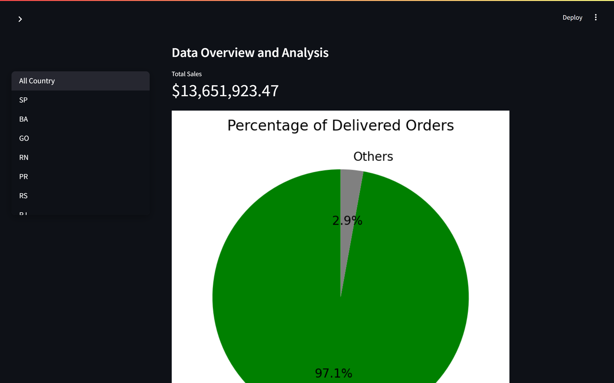

# E-commerce Data Analyst 🛒

## Project Overview
This project focuses on analyzing e-commerce data, starting from formulating questions to answering them using exploratory data analysis (EDA). Some of the key questions addressed in this analysis include:  
- Which products receive the most positive and negative reviews?  
- Are certain products more popular or frequently purchased in specific regions?  
- What is the success rate of product deliveries?  

The project was part of the tasks in a **Dicoding** course, where we explore and apply data analysis techniques in real-world scenarios.

## Dataset
The dataset used in this analysis contains various details related to e-commerce transactions, including product reviews, purchase information, customer demographics, and delivery success. This data allows for deep insights into customer behavior, product performance, and regional differences in purchasing preferences.

## Dependencies
The following dependencies were used in this project:
- **Streamlit**: A framework for building interactive web applications. It is used to create a simple web interface for visualizing and interacting with the analysis results.
- **Pandas**: A powerful data manipulation and analysis library. It is used for handling and processing the dataset, including cleaning, transforming, and analyzing the data.
- **Matplotlib**: A plotting library for creating static, animated, and interactive visualizations. It is used to generate various types of charts and graphs to visualize data patterns.
- **Seaborn**: A statistical data visualization library based on Matplotlib. It is used for creating informative and attractive statistical graphics, such as heatmaps and distribution plots.
- **WordCloud**: A tool to generate word clouds from text data. It is used to visualize the most frequent words or terms in the product reviews for sentiment analysis.

## Methodology
The following steps were taken in this analysis:
1. **Import Libraries**: Import necessary Python libraries for data processing and analysis.
2. **Data Wrangling**: Clean and prepare the data by handling missing values, correcting data types, and merging relevant data sources.
3. **Exploratory Data Analysis (EDA)**: Perform EDA to uncover insights related to product reviews, popularity across regions, and delivery success.
4. **Web Application**: Build a simple web application using **Streamlit** to visualize and interact with the analysis results.

## Web Installation
To run the dashboard web-based application using **Streamlit**, follow these steps:

### 1. **Clone the Repository**
   First, clone the repository to your local machine:

   ```bash
   git clone https://github.com/NurFakhri/E-commerce-Data-Analyst.git
   cd dashboard.py
   ```

### 2. **Create and Activate a Virtual Environment**
   - **For Windows**:
     ```bash
     python -m venv venv
     venv\Scripts\activate
     ```

   - **For macOS/Linux**:
     ```bash
     python3 -m venv venv
     source venv/bin/activate
     ```

### 3. **Install the Required Dependencies**
   Once the virtual environment is activated, install all necessary dependencies by running:

   ```bash
   pip install -r requirements.txt
   ```

   This will install **Streamlit** along with other dependencies required for the project. 

### 4. **Run the Streamlit Application**
   After the installation is complete, you can start the Streamlit web application with the following command:

   ```bash
   streamlit run dashboard.py
   ```

   The application will start, and you can view it by navigating to the URL provided in the terminal.

## Result
### Conclusion for Problem 1:
The product that receives the most positive and negative reviews is the same item. This product is also the highest-selling one by far. Based on this, we recommend using **Natural Language Processing (NLP)** techniques to analyze customer feedback in the comment section to gain deeper insights into customer sentiment.

### Conclusion for Problem 2:
Product popularity varies significantly by region. Certain products contribute up to 20-30% of sales in specific regions. Based on this, marketing and inventory stocking strategies should be tailored to match each region's purchasing preferences for better optimization.

### Conclusion for Problem 3:
The majority of recorded items have been successfully delivered, indicating that the overall delivery process is functioning well. However, further analysis could identify potential areas for improvement in delivery efficiency.

## Website
- Dashboard
  


- Dashboard Diagram
  


## Author
Muhammad Hadi Nur Fakhri
